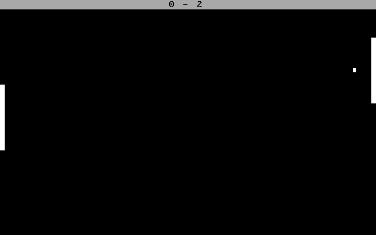

# Pong x86
Single-player bootable pong game in x86 assembly.
Written in Intel x86 assembly with the AT&T syntax using the [bootlib library](https://github.com/m-ou-se/bootlib.git).

Goal:
Beat the AI by reaching 9 points first.
The AI is rather difficult, but it is possible to win.

To run the game (virtualized):
- Make sure you have QEMU installed
- Clone the repo
- Run `make test`

To run the game on real hardware, please refer to the [bootlib](https://github.com/m-ou-se/bootlib) README for instructions.
